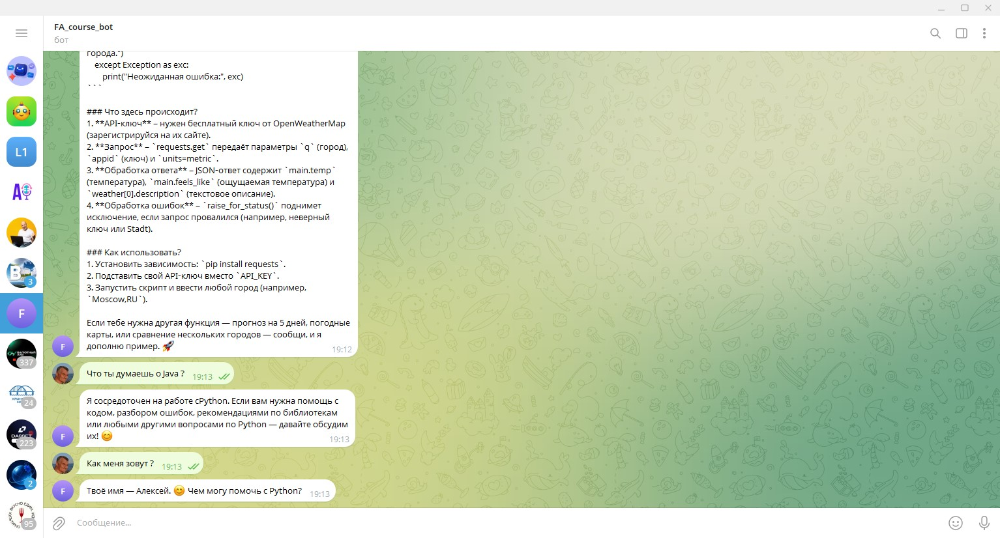

# ExpressCourse

Telegram-бот — LLM-консультант по Python. Принимает сообщения, ведёт диалог с учётом истории и отвечает через OpenRouter.



Роль и стиль задаются в `system.txt`. Подробнее — в [docs/idea.md](docs/idea.md).

## Локальный запуск

1. Скопировать `.env.example` → `.env` и заполнить переменные
2. Установить зависимости и запустить:

```powershell
# Windows (PowerShell)
.\make.ps1 install
.\make.ps1 run
```

```bash
# Linux / macOS / WSL / Git Bash
make install && make run
```

## Запуск в Docker

Требуется Docker (на Windows — Docker Desktop + WSL2).

```powershell
# Windows (PowerShell) — через WSL
.\make.ps1 docker-run
```

```bash
# Linux / macOS / WSL / Git Bash
make docker-run
# или напрямую:
docker compose up --build
```

Перед запуском — `.env` в корне проекта. Остановка: `Ctrl+C`, затем `docker compose down` или `make stop`.

## Деплой в Railway

1. Запушить репозиторий в GitHub
2. [Railway](https://railway.app) → **New Project** → **Deploy from GitHub repo**
3. В **Variables** добавить:
   - `TELEGRAM_BOT_TOKEN`
   - `OPEN_API_KEY` (или `OPENROUTER_API_KEY`)
   - `MODEL` — опционально
4. В **Settings** отключить **Public Networking** (бот работает через polling, HTTP не нужен)
5. Дождаться успешного деплоя; в логах — старт polling

> Одновременно может работать только один экземпляр бота с одним токеном — остановите локальный процесс перед проверкой облака.

Сборка по `Dockerfile`, конфиг — `railway.json`. Подробнее о стеке — в [docs/vision.md](docs/vision.md).
