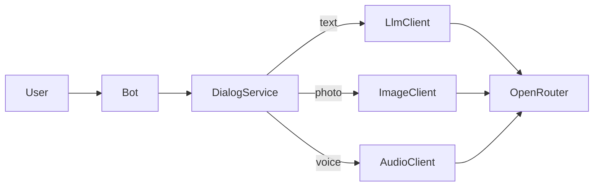

# Техническое видение: ИИ-нутрициолог в Telegram

Документ описывает техническое решение для проверки идеи из [idea.md](idea.md).  
Принцип: **максимально простое решение**, KISS, без оверинжиниринга.

---

## 1. Технологии

### Язык и runtime

- **Python 3.11**

### Управление зависимостями

- **uv** — установка и запуск зависимостей
- Файлы: `pyproject.toml` (секция `[project]`) + `uv.lock`
- Основные команды:
  - `uv sync` — установка зависимостей по lock-файлу
  - `uv run <команда>` — запуск в виртуальном окружении проекта

### Зависимости проекта

| Пакет | Назначение |
|-------|------------|
| `aiogram` | Telegram Bot API, polling |
| `openai` | Клиент для работы с LLM через OpenRouter |
| `python-dotenv` | Загрузка переменных из `.env` |

Дополнительные библиотеки (БД, очереди, web-фреймворки) на этапе MVP не используются.

### Интеграции

| Компонент | Технология |
|-----------|------------|
| Telegram | **aiogram 3.x**, метод **polling** (без webhook); текст, фото, голосовые |
| LLM-провайдер | **openai**-клиент → **OpenRouter** (текст, vision, audio) |
| Текст | Модель задаётся в конфиге (`MODEL`) |
| Фото | Vision-модель OpenRouter (`VISION_MODEL`) |
| Аудио | Модель OpenRouter с [multimodal audio](https://openrouter.ai/docs/guides/overview/multimodal/audio): `input_audio` в base64; **Whisper не используется** |

### Роль ассистента

- Роль: **ИИ-нутрициолог** (см. [idea.md](idea.md))
- Системный промпт — **`system.txt`**: границы роли, тон, уточнение целей перед рекомендациями
- Отдельные промпты под задачи — **`prompts/image.txt`**, **`prompts/audio.txt`** (анализ фото, расшифровка голоса)
- Промпты подключаются как `system`-сообщение в соответствующем клиенте

### Мультимодальность

Три клиента к OpenRouter — **точки расширения** (подмена реализации через конструктор в `main.py`, без ABC):

| Клиент | Вход | Модель | Промпт |
|--------|------|--------|--------|
| `LlmClient` | текст | `MODEL` | `system.txt` |
| `ImageClient` | фото (base64) | `VISION_MODEL` | `prompts/image.txt` |
| `AudioClient` | голос (base64, `input_audio`) | `AUDIO_MODEL` | `prompts/audio.txt` |

`DialogService` маршрутизирует сообщение по типу, подмешивает историю и профиль целей пользователя.

### Сборка и локальный запуск

- **`make.sh`** — shell-скрипт с логикой команд (`install`, `run`, `docker-run`) для Linux, macOS, WSL, Git Bash
- **`make.ps1`** — PowerShell-скрипт с теми же командами для Windows
- **`Makefile`** — тонкая обёртка над `make.sh` для запуска через `make` (Linux, macOS, WSL)
- Примеры:
  - `make install` / `./make.sh install` / `.\make.ps1 install`
  - `make run` / `./make.sh run` / `.\make.ps1 run`
  - `make docker-run` / `./make.sh docker-run` / `.\make.ps1 docker-run`
- На Windows: **PowerShell** — `make.ps1`; также WSL или Git Bash — `make.sh`

### Docker (локально)

- **`Dockerfile`** — образ Python 3.11 + `uv`, запуск `main.py`
- **`docker-compose.yml`** — сборка образа и запуск контейнера (`docker compose up --build`)
- **`.dockerignore`** — исключает `.venv`, `__pycache__`, `.git` и т.п.
- Команда `docker-run` в скриптах вызывает **`docker compose up --build`**; остановка — `docker compose down`
- На **Windows**: `.\make.ps1 docker-run` делегирует в WSL (Docker Desktop + WSL2); также можно напрямую в WSL — `make docker-run` / `./make.sh docker-run`
- На **Linux / macOS**: `make docker-run` / `./make.sh docker-run`

### Деплой в Railway

Облачный хостинг — **[Railway](https://railway.app)**. Тот же Docker-образ, что и локально; отдельный web-сервер не нужен.

| Аспект | Решение |
|--------|---------|
| Способ деплоя | GitHub-репозиторий → Railway, сборка по **`Dockerfile`** |
| Процесс | Один long-running worker: `uv run python main.py` (polling) |
| Webhook | **Не используется** — polling достаточен для MVP |
| Переменные окружения | Панель Railway → Variables (те же ключи, что в `.env.example`) |
| Секреты | Только в Variables Railway; `.env` в репозиторий не коммитится |
| Health check | Не требуется (нет HTTP-эндпоинта); Railway держит контейнер запущенным |
| Перезапуск | При рестарте контейнера история диалога сбрасывается (in-memory) |

Минимальный набор переменных на Railway (вкладка **Variables**):

- `TELEGRAM_BOT_TOKEN`
- `OPEN_API_KEY` (или `OPENROUTER_API_KEY`)
- `MODEL`, `VISION_MODEL`, `AUDIO_MODEL` — опционально (иначе дефолты из `Config`)

Конфиг деплоя — **`railway.json`** (сборка по `Dockerfile`, restart on failure).

---

## 2. Принципы разработки

### KISS

- Цепочка: пользователь → Telegram → `DialogService` → клиент по типу сообщения → OpenRouter → ответ
- Специализация через промпты; разные модели — только там, где нужна другая модальность
- Без БД, кэша, очередей, микросервисов, отдельного STT (Whisper)
- История и цели пользователя — **в памяти процесса** (сбрасываются при перезапуске)
- **Последние 20 пар** user/assistant на пользователя

### ООП: 1 класс = 1 файл

- Каждый класс — отдельный файл в `src/`
- Имя файла — snake_case от имени класса (`LlmClient` → `llm_client.py`)
- Зависимости передаются через конструктор; сборка объектов — в `main.py`

### Минимальное разделение ответственности

| Класс | Зона ответственности |
|-------|---------------------|
| `Bot` | Приём и отправка сообщений Telegram (текст, фото, голос) |
| `LlmClient` | Текстовый диалог через OpenRouter |
| `ImageClient` | Анализ фото еды/продуктов через OpenRouter (vision) |
| `AudioClient` | Транскрипция голоса через OpenRouter (`input_audio` base64) |
| `DialogService` | История, цели пользователя, маршрутизация по типу сообщения |
| `Config` | Настройки, модели и пути к промптам из env |

### Async

- Весь код асинхронный (`async`/`await`) — требование aiogram 3

### Запуск

- Логика команд — в `make.sh` и `make.ps1`; `Makefile` делегирует вызовы в `make.sh`
- Команды: `install`, `run`, `docker-run` (локальный Docker — через `docker compose`)
- Облако: деплой на Railway по `Dockerfile`, без дополнительных скриптов

### Без оверинжиниринга

- Нет абстрактных базовых классов и паттернов «на будущее»
- Нет тестовой инфраструктуры на старте
