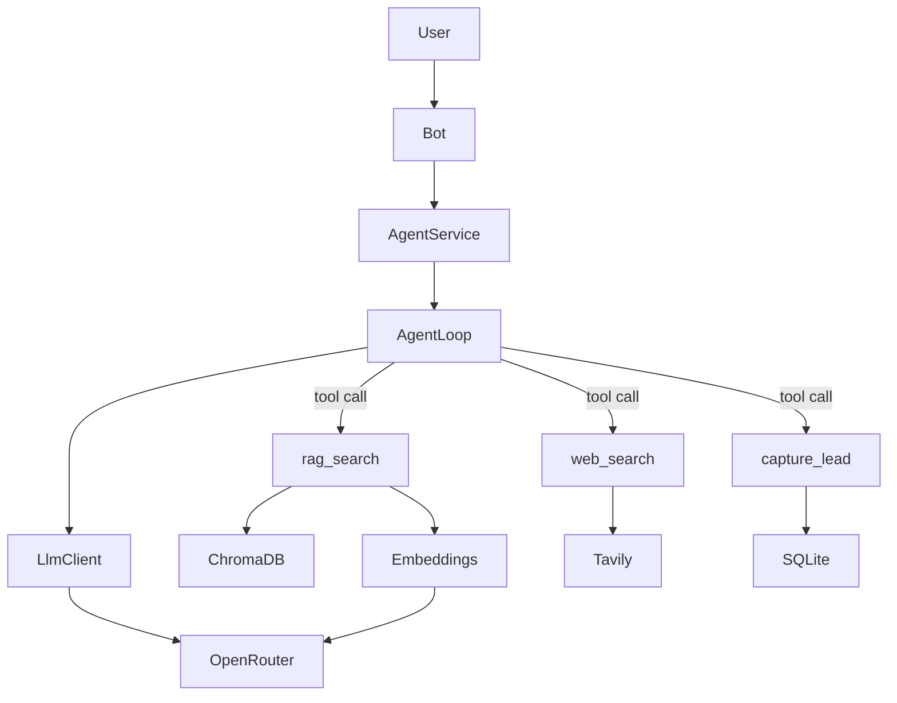

# Техническое видение: ИИ-агент-консультант в Telegram

Документ описывает техническое решение для проверки идеи из [idea.md](idea.md).  
Принцип: **максимально простое решение**, KISS, без оверинжиниринга.

---

## 1. Технологии

### Язык и runtime

- **Python 3.11**

### Управление зависимостями

- **uv** — установка и запуск зависимостей
- Файлы: `pyproject.toml` (секция `[project]`) + `uv.lock`
- Основные команды:
  - `uv sync` — установка зависимостей по lock-файлу
  - `uv run <команда>` — запуск в виртуальном окружении проекта

### Зависимости проекта

| Пакет | Назначение |
|-------|------------|
| `aiogram` | Telegram Bot API, polling |
| `openai` | LLM, embeddings, tool calling через OpenRouter |
| `python-dotenv` | Загрузка переменных из `.env` |
| `chromadb` | Векторная БД для RAG (persistent) |
| `pymupdf4llm` | Парсинг PDF в markdown для индексации |
| `tavily-python` | Веб-поиск (Tavily Search API) |
| `langsmith` | Трейсинг агентного цикла и инструментов (`@traceable`) |

`sqlite3` — стандартная библиотека Python (лиды).  
Очереди, web-фреймворки и тяжёлые AI-фреймворки (LangChain и аналоги) **не используются**.

### Интеграции

| Компонент | Технология |
|-----------|------------|
| Telegram | **aiogram 3.x**, метод **polling** (без webhook); текст |
| LLM-провайдер | **openai**-клиент → **OpenRouter** (`LLM_BASE_URL`) |
| Agent loop | **openai SDK tool calling** — явный цикл: запрос → tool calls → выполнение → ответ |
| Векторная БД | **chromadb** (persistent, `./data/chroma`) |
| PDF-парсинг | **pymupdf4llm** — корпоративные материалы из `data/` |
| Веб-поиск | **tavily-python** (Tavily Search API) |
| Лид-система | **sqlite3** (`./data/leads.db`) |
| Embeddings | **openai** `text-embedding-3-small` через тот же `LLM_BASE_URL` (OpenRouter); модель задаётся в `.env` |
| Трейсинг | **langsmith** — `@traceable` на ключевых async-функциях; вкл/выкл через `LANGSMITH_ENABLED` |

### Роль ассистента

- Роль: **ИИ-консультант компании** (см. [idea.md](idea.md))
- Системный промпт — **`prompts/system.txt`**: тон, границы роли, сценарии консультации и сбора заявки
- Путь к промпту задаётся в `.env` (`SYSTEM_PROMPT_FILE=prompts/system.txt`)
- Промпт подключается как `system`-сообщение в агентном цикле

### Агентный цикл и инструменты

Один текстовый клиент к OpenRouter с **tool calling**. `AgentService` ведёт явный цикл:

1. Сообщение пользователя + история → LLM с описанием инструментов.
2. Если модель вызывает tool — выполнить, вернуть результат в контекст.
3. Повторять, пока модель не вернёт финальный текстовый ответ.
4. Ответ отправить пользователю в Telegram.

| Инструмент | Назначение |
|------------|------------|
| `rag_search` | Поиск по корпоративным PDF в ChromaDB (портфолио, услуги, программы) |
| `web_search` | Проверка актуальных фактов в интернете (Tavily) |
| `capture_lead` | Сохранение заявки: имя и контакт в SQLite |

### Трейсинг (LangSmith)

**LangSmith обязателен** для наблюдаемости агентного цикла. Используется только SDK `langsmith` (без LangChain).

- Импорт: `from langsmith import traceable`
- Ключевые async-методы помечаются **`@traceable`** — каждый вызов попадает в trace как отдельный span
- Включение/выключение отправки traces — через `.env`: `LANGSMITH_ENABLED`, `LANGSMITH_API_KEY`, `LANGSMITH_PROJECT` (инициализация в `main.py` / `Config`)
- При `LANGSMITH_ENABLED=false` декоратор остаётся на функциях; traces не отправляются

| Функция / метод | Где | Зачем в trace |
|-----------------|-----|---------------|
| `AgentService.handle_message` (или аналог) | `agent_service.py` | Корневой span диалога |
| `LlmClient.chat` | `llm_client.py` | Запросы к LLM и tool calling |
| `EmbeddingClient.embed` | `embedding_client.py` | Эмбеддинги для RAG |
| `RagService.search` | `rag_service.py` | Tool `rag_search` |
| `WebSearchTool.search` | `web_search_tool.py` | Tool `web_search` |
| `LeadStore.capture` | `lead_store.py` | Tool `capture_lead` |

Новые инструменты и шаги агентного цикла — **с `@traceable` по умолчанию**.

### База знаний и данные

| Путь | Содержимое |
|------|------------|
| `data/` | Исходные PDF компании (портфолио, услуги, курсы) |
| `data/chroma/` | Persistent-индекс ChromaDB (создаётся при индексации) |
| `data/leads.db` | SQLite: заявки на консультацию |

Индексация PDF — отдельная команда или шаг при старте (загрузка/обновление эмбеддингов в ChromaDB).

### Сборка и локальный запуск

- **`make.sh`** — shell-скрипт с логикой команд (`install`, `run`, `docker-run`) для Linux, macOS, WSL, Git Bash
- **`make.ps1`** — PowerShell-скрипт с теми же командами для Windows
- **`Makefile`** — тонкая обёртка над `make.sh` для запуска через `make` (Linux, macOS, WSL)
- Примеры:
  - `make install` / `./make.sh install` / `.\make.ps1 install`
  - `make run` / `./make.sh run` / `.\make.ps1 run`
  - `make docker-run` / `./make.sh docker-run` / `.\make.ps1 docker-run`
- На Windows: **PowerShell** — `make.ps1`; также WSL или Git Bash — `make.sh`

### Docker (локально)

- **`Dockerfile`** — образ Python 3.11 + `uv`, запуск `main.py`
- **`docker-compose.yml`** — сборка образа и запуск контейнера (`docker compose up --build`)
- **`.dockerignore`** — исключает `.venv`, `__pycache__`, `.git` и т.п.
- **Volume `./data`** — ChromaDB и `leads.db` сохраняются между перезапусками контейнера
- Команда `docker-run` в скриптах вызывает **`docker compose up --build`**; остановка — `docker compose down`
- На **Windows**: `.\make.ps1 docker-run` делегирует в WSL (Docker Desktop + WSL2); также можно напрямую в WSL — `make docker-run` / `./make.sh docker-run`
- На **Linux / macOS**: `make docker-run` / `./make.sh docker-run`

### Деплой в Railway

Облачный хостинг — **[Railway](https://railway.app)**. Тот же Docker-образ, что и локально; отдельный web-сервер не нужен.

| Аспект | Решение |
|--------|---------|
| Способ деплоя | GitHub-репозиторий → Railway, сборка по **`Dockerfile`** |
| Процесс | Один long-running worker: `uv run python main.py` (polling) |
| Webhook | **Не используется** — polling достаточен |
| Переменные окружения | Панель Railway → Variables (те же ключи, что в `.env.example`) |
| Секреты | Только в Variables Railway; `.env` в репозиторий не коммитится |
| Health check | Не требуется (нет HTTP-эндпоинта); Railway держит контейнер запущенным |
| Persistent data | Volume для `./data` (ChromaDB + leads); при рестарте без volume индекс и лиды теряются |
| История диалога | In-memory; сбрасывается при перезапуске процесса |

Минимальный набор переменных на Railway (вкладка **Variables**):

- `TELEGRAM_BOT_TOKEN`
- `OPEN_API_KEY` (или `OPENROUTER_API_KEY`)
- `LLM_BASE_URL`, `MODEL`, `EMBEDDING_MODEL`
- `TAVILY_API_KEY`
- `SYSTEM_PROMPT_FILE` — опционально (иначе дефолт из `Config`)
- `LANGSMITH_ENABLED`, `LANGSMITH_API_KEY`, `LANGSMITH_PROJECT` — трейсинг (рекомендуется `LANGSMITH_ENABLED=true` на prod)

Конфиг деплоя — **`railway.json`** (сборка по `Dockerfile`, restart on failure).

---

## 2. Принципы разработки

### KISS

- Цепочка: пользователь → Telegram → `AgentService` → агентный цикл (LLM + tools) → ответ
- **Без LangChain и тяжёлых AI-фреймворков** — только openai SDK и минимальные библиотеки
- **Агентный цикл явный и читаемый** — tool calling в коде, без скрытых оркестраторов
- Специализация через системный промпт и набор инструментов
- Без микросервисов, очередей, отдельного web-сервера
- История диалога — **в памяти процесса** (сбрасывается при перезапуске)
- **Последние 20 пар** user/assistant на пользователя
- Persistent-хранилища — только там, где нужны продукту: RAG (ChromaDB) и лиды (SQLite)

### ООП: 1 класс = 1 файл

- Каждый класс — отдельный файл в `src/`
- Имя файла — snake_case от имени класса (`LlmClient` → `llm_client.py`)
- Зависимости передаются через конструктор; сборка объектов — в `main.py`

### Минимальное разделение ответственности

| Класс | Зона ответственности |
|-------|---------------------|
| `Bot` | Приём и отправка текстовых сообщений Telegram |
| `AgentService` | История, агентный цикл, вызов инструментов |
| `LlmClient` | Запросы к OpenRouter: chat + tool calling |
| `EmbeddingClient` | Эмбеддинги для RAG (`text-embedding-3-small`) |
| `RagService` | Индексация PDF и `rag_search` по ChromaDB |
| `WebSearchTool` | `web_search` через Tavily |
| `LeadStore` | `capture_lead` — запись заявок в SQLite |
| `Config` | Настройки, модели, пути к промптам и данным из env |

### Async

- Весь I/O асинхронный (`async`/`await`) — aiogram 3, HTTP-запросы к API

### Трейсинг

- Зависимость **`langsmith`** обязательна; ключевые async-методы — с **`@traceable`**
- Список трейсируемых функций — см. §1 «Трейсинг (LangSmith)»
- Без LangChain: только декоратор и env-переменные LangSmith

### Запуск

- Логика команд — в `make.sh` и `make.ps1`; `Makefile` делегирует вызовы в `make.sh`
- Команды: `install`, `run`, `docker-run` (локальный Docker — через `docker compose`)
- Облако: деплой на Railway по `Dockerfile`, без дополнительных скриптов

### Без оверинжиниринга

- Нет абстрактных базовых классов и паттернов «на будущее»
- Нет LangChain, LlamaIndex и аналогов
- Нет тестовой инфраструктуры на старте
